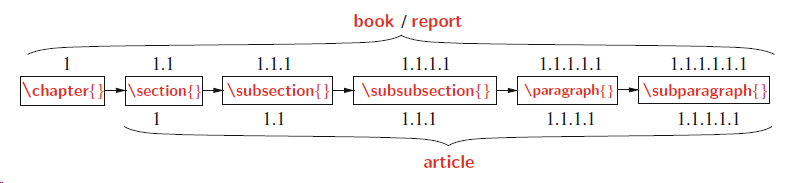
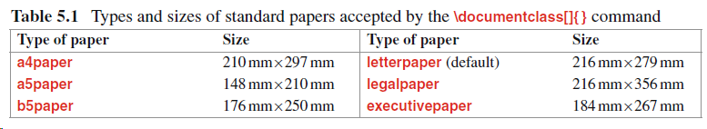

 <script src="../ut.js" type="text/javascript"></script>


# preamble

生成文档的全局处理参数
\documentclass[ ] (dtype)
[]为选项，可以有若干无序参数

# body

\begin{document}
\end{document}

# LaTeX语言

由环境与命令组成

## 命令

一条独立指令，用于生成新内容或更改现有项目的形式

\latex

\\copyright

## 环境

由两个互补命令组成，可以执行某些特定的工作

创建环境
\begin(ename)
\end{ename}

## 包

通过\documentclass {}命令的强制参数合并的文档类（或类型），包括文档的一些基本功能，例如页面布局和分节。还提供了在文档中调用其他命令和环境的功能，以添加不属于标准文档类的其他功能。
此类命令和环境在单独的文件（称为包）中定义。

\usepackage{pname}
\usepackage{amssymb,amsmath} 用于生成彩色文字，或用于生成AMS类型的数字符号和类型。

许多包接受[ ]可选指令

\documentclass 对于全局生效，包括其他包，而\usepackage仅对局部加载的包生效

## 字符

键盘输入


通过命令输入（本身在LaTeX中有原意）
可以用\verb"$"打印美元符号

| 字符 | 纯字符          | 功能                         |
| ---- | --------------- | ---------------------------- |
| $    | \\$             | 内联数学模式                 |
| %    | \%              | 注释                         |
| { }  | \\{\\}          | 强制参数                     |
| _    | \\-             | 数学模式生成下标             |
| ^    | \^\             | 生成上标                     |
| &    | \\&             | 分割表中两列                 |
| #    | \\#             | 其他符号                     |
| \    | \$\blackslash\$ | 命令以\开头                  |
| ~    | \$\sim\$        | 绑定两个要打印在同一行的单词 |
| \|   | \$\|\$          | 在表格中生成生成（列）线     |
| < >  | \$< >\$         | 无                           |

数学字符（见gnki）

# 文字模式

## 文本模式

包括：paragraph模式、LR模式


## math模式


## 强调

## 彩色字体

# 格式化文本1

## 文章结构


章以整数编号，后面接标签词和标题

章可以包含多个节，节包含多个小节，三层结构 2.5.3、6.2.2

书信类不支持任何分段单位

需要省略的加*号，如序言 \chapter\*{}

## 标签与编号

LaTeX会为许多环境和环境中的变量分配序号

允许通过唯一的参考关键字编码的项目，该关键字可用于引用同一文档中任何部分的项目（未编号的除外）

\label{rkey} 标记已编号项目
\ref{rkey} 对上面标记进行引用
rkey是item的唯一关键字

有一些打印出现编号项目的页码的命令
\pageref{rkey}
\vref{rkey}
\vpageref{rkey}

## 对齐

默认为两边都对齐

左对齐
\begin{flushleft}
\end{flushleft}

右对齐
\begin{flushright}
\end{flushright}

居中对齐
\begin{center}
\end{center}

## 引用

建议用`'来引用，用一次产生单引号，两次产生双引号

引用环境
\begin{quotation}
\end{quotation}

```tex
\LaTeX\ prints texts with both side aligned,
covering the specified width of a page.
\begin{quotation}
\begin{spacing}{1.2}
Quoted statements are also printed with both side
aligned, but in a narrowed width.
	\begin{flushright}
	{\it - Anonymous}
	\end{flushright}
\end{spacing}
\end{quotation}
The ‘quotation’ environment is used for printing
quoted statements in a narrowed width.
```

## 新段落

不会按回车来设置新行和段落

新行
\newline
\linebreak 强制最后一行覆盖整个页面宽度
\\\
\\\\\ 会产生一个空白行

新段落
尽量使用预定义的宏来创建统一的段落

## 空白

一系列空格和Tab键产生的空格被视为一个


# 格式化文本2

## 深化结构



如果不需要编号，可以使用负编号

## 改标题

## 多栏

可以使用\document[]{}中的twocolumn选项，也可以使用\twocolumn[ ]
除非单列模式用于单列打印文章的摘要外，不要混用。

参数


## Mini pages

## 脚标

# 页布局

## 标准布局



可选项portrait(纵向，默认，较长尺寸在垂直方向)与landscape（横向）

## 改变部分


## 自定义尺寸


# 列表与对齐

## 制表环境

\begin{tabbing}
\= \\\
\\>\\\
\\>
\end{tabbing}

# 图

# 自定义宏

## 定义命令

\newcommand{newc}{aval}或\providecommand{newc}{aval} newc代表新命令
aval代表属性，新命令名称只能为字母，不能以end开头，不能与现有命令相同。
\providecommand{newc}{aval} newc 不会返回是否冲突，故尽量不用。


## 定义环境

# 文献

# 目录

# 错误信息