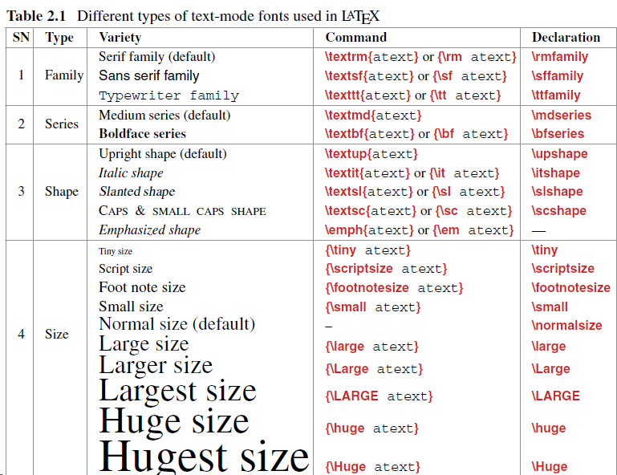

# preamble

生成文档的全局处理参数
\document
[]为选项，可以有若干无序参数

# body

\begin{document}
\end{document}

# LaTeX语言

由环境与命令组成

## 命令

一条独立指令，用于生成新内容或更改现有项目的形式

\latex

\\copyright

## 环境

由两个互补命令组成，可以执行某些特定的工作

创建环境
\begin(ename)
\end{ename}

## 包

通过\documentclass {}命令的强制参数合并的文档类（或类型），包括文档的一些基本功能，例如页面布局和分节。还提供了在文档中调用其他命令和环境的功能，以添加不属于标准文档类的其他功能。
此类命令和环境在单独的文件（称为包）中定义。

\usepackage{pname}
\usepackage{amssymb,amsmath} 用于生成彩色文字，或用于生成AMS类型的数字符号和类型。

许多包接受[ ]可选指令

\documentclass 对于全局生效，包括其他包，而\usepackage仅对局部加载的包生效

## 字符

### 键盘输入

### 通过命令输入（本身在LaTeX中有原意）

可以用\verb"$"打印美元符号

| 字符 | 纯字符          | 功能                         |
| ---- | --------------- | ---------------------------- |
| $    | \\$             | 内联数学模式                 |
| %    | \%              | 注释                         |
| { }  | \\{\\}          | 强制参数                     |
| _    | \\-             | 数学模式生成下标             |
| ^    | \^\             | 生成上标                     |
| &    | \\&             | 分割表中两列                 |
| #    | \\#             | 其他符号                     |
| \    | \$\blackslash\$ | 命令以\开头                  |
| ~    | \$\sim\$        | 绑定两个要打印在同一行的单词 |
| \|   | \$\|\$          | 在表格中生成生成（列）线     |
| < >  | \$< >\$         | 无                           |

### 数学字符（见anki）

# 文字模式

## 文本模式

包括：paragraph模式、LR模式

## math模式

## 强调

## 彩色字体

# 格式化文本

## 文章结构

## 标签与编号

## 对齐

## 引用

# 页布局

# 表