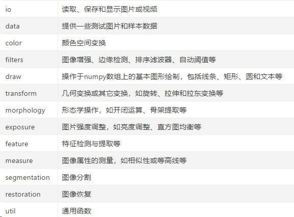

# 医学知识

## 前列腺癌的诊断

数字直肠检查（DRE）：在DRE期间，医生将戴手套的润滑手指插入直肠，以检查与直肠相邻的前列腺。
如果您的医生发现腺体的纹理，形状或大小有任何异常，则可能需要进一步检查。
前列腺特异性抗原（PSA）测试：从您手臂的静脉中抽取血液样品，并分析PSA（一种由前列腺自然产生的物质）。
少量PSA进入您的血液是正常的。如果发现水平高于正常水平，则可能表明前列腺感染，炎症，肿大或癌症。

如果DRE或PSA测试检测到异常，您的医生可能会建议您做进一步的检查以确定您是否患有前列腺癌，例如：超声。
如果其他检查引起了关注，您的医生可能会使用经直肠超声来进一步评估您的前列腺。

将一根大约雪茄大小和形状的小探针插入直肠，该探头使用声波来创建您的前列腺图像。收集前列腺组织样本：如果初步检查结果表明前列腺癌，您的医生可能会建议从前列腺中收集细胞样本的程序（前列腺活检）。前列腺穿刺活检通常使用一根细针进行，穿刺针插入前列腺以收集组织。在实验室中分析组织样本，以确定是否存在癌细胞。

当活检确认癌症的存在时，下一步就是确定癌细胞的侵袭性（等级）水平。
实验室病理学家检查您的癌症样本，以确定癌细胞与健康细胞的差异。
较高的等级表示更具侵略性的癌症，更可能迅速扩散。
用于评估前列腺癌细胞等级的最常见量表称为格里森评分。
格里森（Gleason）得分结合了两个数字，范围从2（非侵略性癌症）到10（非常侵略性癌症），尽管该范围的较低部分并不经常使用。

- Gleason score 6 = ISUP grade 1
- Gleason score 7 (3 + 4) = ISUP grade 2
- Gleason score 7 (4 + 3) = ISUP grade 3
- Gleason score 8 = ISUP grade 4
- Gleason score 9-10 = ISUP grade 5

# 数据的统计与可视化

## 对主目录路径的设置

```python
import os																																							
main_path = "../input/prostate-cancer-grade-assessment"
train_path = "../input/prostate-cancer-grade-assessment/train_images"
label_path = "../input/prostate-cancer-grade-assessment/train_label_masks"

os.path.jion

```

## 查看原始数据与图片


## 读取与分析标签

利用panda读取CSV信息，

# 图像的采样

## 库

### Skimage

对图像进行压缩

```
import Skimage

```

Skimage库是基于scipy的图像处理包，名scikit-image,将图片作为numpy数组进行处理。

主要子模块：io\data\color\filters\draw\transform\morphology\exposure(图像强度调整)\feature\measure\segmentation\restoration



**读取图片**

```
from skimage import io
img = io.imread('test.png', as_gray=False)  # 第一个参数是文件名可以是网络地址，第二个参数默认为False，True时为灰度图

print(type(img))  #显示类型
print(img.shape)  #显示尺寸
print(img.dtype)   #数据类型

print(img.shape[0])  #图片高度
print(img.shape[1])  #图片宽度
print(img.shape[2])  #图片通道数

print(img.max())  #最大像素值
print(img.min())  #最小像素值
print(img.mean()) #像素平均值

print(img[200][100]) 
#输出某个像素值
pixel = img[20,30,1]
print(pixel)

```

skimage.io.imread打开的图片类型为np数组, 值为0-255，尺寸为 H,W,C，resize后值为0-1

```bash
image = transform.resize(img, (100, 200), order=1)
print(skimage.img_as_float(image))   # img_as_float可以把image转为double，即float64 
```

**图像显示**

```kotlin
from skimage import io,data
import matplotlib.pyplot as plt
img = data.coffee()

#skimage.io.imshow()显示图像
io.imshow(img)  # 显示图片
#io.imsave('test1.jpg', img) # 保存图片
plt.show()

#skimage.viewer.ImageViewer()显示图像
viewer = ImageViewer(img)
viewer.show()

# 红色单通道访问
R = img[:,:,0]
print(R)
io.imshow(R)
plt.show()
```

**图像裁剪**

通过对数组的裁剪，就可以实现对图片的裁剪。

```dart
from skimage import io, data
import matplotlib.pyplot as plt
img = data.coffee()
roi = img[80:180,100:200,:]
print(roi)
io.imshow(roi)
plt.show()
```


### tqdm.notebook

### zipile

### openlide

## 图像处理方法

### 边缘填充

#### np.pad

第一个参数为待填充数组，第二个参数为填充的形状，第三个参数为填充方法

## 图像采样

## 16\*128\*128源代码

```python
import os
import cv2
import skimage.io
from tqdm.notebook import tqdm
import zipfile
import numpy as np

TRAIN = '../input/prostate-cancer-grade-assessment/train_images/'
MASKS = '../input/prostate-cancer-grade-assessment/train_label_masks/'
OUT_TRAIN = 'train.zip'
OUT_MASKS = 'masks.zip'
sz = 128
N = 16

N = 16 #每个图切成16块
def tile(img, mask):
    result = []
    shape = img.shape
    #shape[0] 高度 shpe[1]宽度
    pad0,pad1 = (sz - shape[0]%sz)%sz, (sz - shape[1]%sz)%sz
    img = np.pad(img,[[pad0//2,pad0-pad0//2],[pad1//2,pad1-pad1//2],[0,0]],constant_values=255)
    mask = np.pad(mask,[[pad0//2,pad0-pad0//2],[pad1//2,pad1-pad1//2],[0,0]],constant_values=0)
    img = img.reshape(img.shape[0]//sz,sz,img.shape[1]//sz,sz,3)
    img = img.transpose(0,2,1,3,4).reshape(-1,sz,sz,3)
    
    #实现了切片工作
    mask = mask.reshape(mask.shape[0]//sz,sz,mask.shape[1]//sz,sz,3)
    mask = mask.transpose(0,2,1,3,4).reshape(-1,sz,sz,3)
    #对切片不够的图像进行填充
    if len(img) < N:
        mask = np.pad(mask,[[0,N-len(img)],[0,0],[0,0],[0,0]],constant_values=0)
        img = np.pad(img,[[0,N-len(img)],[0,0],[0,0],[0,0]],constant_values=255)
    #返回数组从小到大的索引值
    idxs = np.argsort(img.reshape(img.shape[0],-1).sum(-1))[:N]
    img = img[idxs]
    mask = mask[idxs]
    for i in range(len(img)):
        result.append({'img':img[i], 'mask':mask[i], 'idx':i})
    return result
  
x_tot,x2_tot = [],[]
names = [name[:-10] for name in os.listdir(MASKS)]
with zipfile.ZipFile(OUT_TRAIN, 'w') as img_out,\
 zipfile.ZipFile(OUT_MASKS, 'w') as mask_out:
    for name in tqdm(names):
        img = skimage.io.MultiImage(os.path.join(TRAIN,name+'.tiff'))[-1]
        mask = skimage.io.MultiImage(os.path.join(MASKS,name+'_mask.tiff'))[-1]
        tiles = tile(img,mask)
        for t in tiles:
            img,mask,idx = t['img'],t['mask'],t['idx']
            x_tot.append((img/255.0).reshape(-1,3).mean(0))
            x2_tot.append(((img/255.0)**2).reshape(-1,3).mean(0)) 
            #if read with PIL RGB turns into BGR
            img = cv2.imencode('.png',cv2.cvtColor(img, cv2.COLOR_RGB2BGR))[1]
            img_out.writestr(f'{name}_{idx}.png', img)
            mask = cv2.imencode('.png',mask[:,:,0])[1]
            mask_out.writestr(f'{name}_{idx}.png', mask)
            
#image stats
img_avr =  np.array(x_tot).mean(0)
img_std =  np.sqrt(np.array(x2_tot).mean(0) - img_avr**2)
print('mean:',img_avr, ', std:', np.sqrt(img_std))
```

openslide下采样源码

```python
import numpy as np
import openslide
from openslide import deepzoom
from matplotlib import pyplot as plt

#Images / Masks Directories
images_dir = "../input/prostate-cancer-grade-assessment/train_images/"
masks_dir = "../input/prostate-cancer-grade-assessment/train_label_masks/"

#Files
image_files = os.listdir(images_dir)
mask_files = os.listdir(masks_dir)
mask_files_cleaned = [i.replace("_mask", "") for i in mask_files]

#Clean Images without Masks
images_with_masks = list(set(image_files).intersection(mask_files_cleaned))
len(image_files), len(mask_files), len(images_with_masks)


```

# 对于mask的处理

# 深度学习代码基准


# 参考文献：

[skimage库]: https://www.jianshu.com/p/be7af337ffcd
[np.pad]: https://blog.csdn.net/hustqb/article/details/77726660
[zipfile]: https://www.jianshu.com/p/b9da5fd2e5cf
[openslide库]: https://openslide.org/api/python/
[16*128*128]: https://www.kaggle.com/iafoss/panda-16x128x128-tiles/output
[openslide下采样]: https://www.kaggle.com/jberros/panda-wsi-manipulation-openslide-overview
[KAGGLE基准]:(https://www.kaggle.com/rohitsingh9990/panda-eda-better-visualization-simple-baseline)

