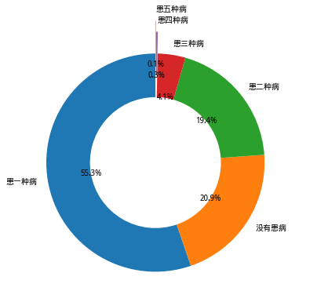

<table>
<tbody>
<tr><td>患一种病</td><td style="text-align: right;">1061</td></tr>
<tr><td>没有患病</td><td style="text-align: right;"> 401</td></tr>
<tr><td>患二种病</td><td style="text-align: right;"> 373</td></tr>
<tr><td>患三种病</td><td style="text-align: right;">  79</td></tr>
<tr><td>患四种病</td><td style="text-align: right;">   5</td></tr>
<tr><td>患五种病</td><td style="text-align: right;">   1</td></tr>
</tbody>
</table>

