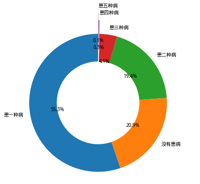
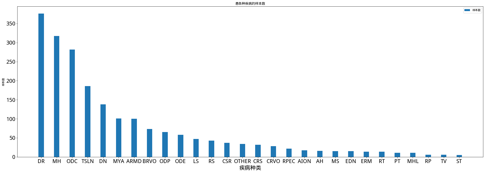

# 统计数据分析







# 进行二分类

**目标：**


# 使用DenseNet网络进行多分类

**目标：**
- 使用的前六种疾病（排除MH）进行训练，多标签数据的处理
- 跑通网络，试着做数据均衡
> PyTorch的Weighted Random Sampler和Batch Sampler
- 绘制ROC、计算AUX、计算mPA、绘制中间特征
> <https://shawnzhang31.com/opencv-learning/bundle3/Week8/EvaluationMetrics/wk8_mean_average_precision.html>

处理多标签、多类别:<https://blog.csdn.net/qq_27009517/article/details/80264919>


## 糖尿病疾病特征

糖尿病疾病的几个显著特征：硬性渗出、视网膜出血、渗出液

现在用ResNet网络到底学到的是一个什么样的特征？

如何平衡正负样本？


## 训练策略

- 直接用神经网络进行训练并分类。进行多分类或者二分类，需要确定筛选出哪些疾病
  这些疾病要有比较差异性的特征方便网络进行训练；并且这些疾病相关性不能太大

- 不同疾病间有相同的特征的，先提取特征（传统数学方法、影像组学、机器学习、神经网络），然后进行特征融合。最后进行分类（可以使用机器学习或者神经网络方法）。

- 对于某些疾病单独拎出来进行判断与训练，如血管瘤。

## 实现多分类

**探索：**
用一类疾病与正常疾病进行训练，然后打印中间特征，查看其训练效果。

使用的数据:

仅考虑两个标签的样本

```python
	DR	ODC	TSLN	DN	MYA	ARMD
DR	376	30	32	3	3	0
ODC	30	282	48	10	23	9
TSLN	32	48	186	16	0	31
DN	3	10	16	138	0	4
MYA	3	23	0	0	101	24
ARMD	0	9	31	4	24	100
```


可以观察出DR、ODC、TSLN具有比较大的相关性 \
DN与其他所有类有比较大的独立性 \
MYA与ODC、ARMD有比较大的相关性
ARMD与MYA、ARMD有比较大的相关性

首先进行三分类，
