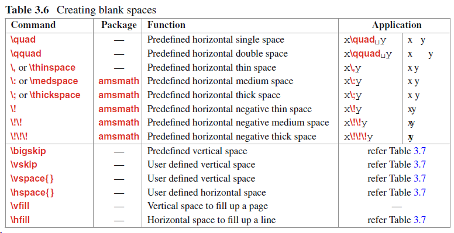

<script src="../ut.js" type="text/javascript"></script>


# 公式中的LaTex

- [上下标](./LaTex/上下标.html)-[edit](./LaTex/上下标.md)
- [关系符号](./LaTex/关系符号.html)-[edit](./LaTex/关系符号.md)
- [堆叠](./LaTex/堆叠.html)-[edit](./LaTex/堆叠.md)
- [字体](./LaTex/字体.html)-[edit](./LaTex/字体.md)
- [常规函数](./LaTex/常规函数.html)-[edit](./LaTex/常规函数.md)
- [特殊字符](./LaTex/特殊字符.html)-[edit](./LaTex/特殊字符.md)
- [界限](./LaTex/界限.html)-[edit](./LaTex/界限.md)
- [矩阵](./LaTex/矩阵.html)-[edit](./LaTex/矩阵.md)
- [空格破折号箭头](./LaTex/空格破折号箭头.html)-[edit](./LaTex/空格破折号箭头.md)


# 内容结构


常见的LATEX公式

模板的使用

通用命令

# LATEX公式


# preamble

生成文档的全局处理参数
\documentclass[ ] (dtype)
[]为选项，可以有若干无序参数

# body

\begin{document}
\end{document}

# LaTeX语言

由环境与命令组成

## 命令

一条独立指令，用于生成新内容或更改现有项目的形式

\latex

\\copyright

## 环境

由两个互补命令组成，可以执行某些特定的工作

创建环境
\begin(ename)
\end{ename}

## 包

通过\documentclass {}命令的强制参数合并的文档类（或类型），包括文档的一些基本功能，例如页面布局和分节。还提供了在文档中调用其他命令和环境的功能，以添加不属于标准文档类的其他功能。
此类命令和环境在单独的文件（称为包）中定义。

\usepackage{pname}
\usepackage{amssymb,amsmath} 用于生成彩色文字，或用于生成AMS类型的数字符号和类型。

许多包接受[ ]可选指令

\documentclass 对于全局生效，包括其他包，而\usepackage仅对局部加载的包生效

## 字符

可以用\verb"$"打印美元符号

数学字符（见gnki）

# 文字模式

## 文本模式

包括：paragraph模式、LR模式


## math模式


## 强调

## 彩色字体

# 格式化文本1

## 文章结构


章以整数编号，后面接标签词和标题

章可以包含多个节，节包含多个小节，三层结构 2.5.3、6.2.2

书信类不支持任何分段单位

需要省略的加*号，如序言 \chapter\*{}

## 标签与编号

LaTeX会为许多环境和环境中的变量分配序号

允许通过唯一的参考关键字编码的项目，该关键字可用于引用同一文档中任何部分的项目（未编号的除外）

\label{rkey} 标记已编号项目
\ref{rkey} 对上面标记进行引用
rkey是item的唯一关键字

有一些打印出现编号项目的页码的命令
\pageref{rkey}
\vref{rkey}
\vpageref{rkey}

## 对齐

默认为两边都对齐

左对齐
\begin{flushleft}
\end{flushleft}

右对齐
\begin{flushright}
\end{flushright}

居中对齐
\begin{center}
\end{center}

## 引用

建议用`'来引用，用一次产生单引号，两次产生双引号

引用环境
\begin{quotation}
\end{quotation}

```tex
\LaTeX\ prints texts with both side aligned,
covering the specified width of a page.
\begin{quotation}
\begin{spacing}{1.2}
Quoted statements are also printed with both side
aligned, but in a narrowed width.
	\begin{flushright}
	{\it - Anonymous}
	\end{flushright}
\end{spacing}
\end{quotation}
The ‘quotation’ environment is used for printing
quoted statements in a narrowed width.
```


## 新段落

不会按回车来设置新行和段落

```python
#新行
\newline
#强制最后一行覆盖整个页面宽度
\linebreak 
\\\
\\\\\ #会产生一个空白行
```


新段落
尽量使用预定义的宏来创建统一的段落

## 空白

一系列空格和Tab键产生的空格被视为一个




# 格式化文本2

## 深化结构


如果不需要编号，可以使用负编号

## 改标题

## 多栏

可以使用\document[]{}中的twocolumn选项，也可以使用\twocolumn[ ]
除非单列模式用于单列打印文章的摘要外，不要混用。

参数


## Mini pages

## 脚标

# 页布局

## 标准布局


可选项portrait(纵向，默认，较长尺寸在垂直方向)与landscape（横向）

## 改变部分


## 自定义尺寸


# 列表与对齐

## 制表环境

```python

\begin{tabbing}
\= \\\
\\>\\\
\\>
\end{tabbing}
```


# 图

# 自定义宏

## 定义命令

\newcommand{newc}{aval}或\providecommand{newc}{aval} newc代表新命令
aval代表属性，新命令名称只能为字母，不能以end开头，不能与现有命令相同。
\providecommand{newc}{aval} newc 不会返回是否冲突，故尽量不用。


## 定义环境

# 文献

# 目录

# 错误信息


latex模块

# 章节

\section
\subsection
\subsubsection

# 使用图片

\begin{figure}[htbp]
  \centering
  \includegraphics[width=0.5\textwidth]{donate.jpg}
  \caption{一键三连求赞}
\end{figure}

# 不缩进 加粗
\noindent  \textbf{赞赏费用的使用解释权归 Elegant\LaTeX{} 所有，并且不接受监督，请自愿理性打赏}。

# 内置文字类型
\lstinline{founder} 

# 进行枚举（带编号）

\begin{enumerate}

\item

\end{enumerate}

# 链接
\href{https://github.com/peggy2006xzyz}{YPY}

# 不带编号进行枚举

\begin{itemize}
 \item

\end{itemize}


# 使用代码块
\begin{lstlisting}
\author{author 1\\ org. 1 \and author 2 \\ org. 2 }
\end{lstlisting}


# 使用Latex公式
\begin{equation}
  \int_{R^q} f(x,y) dy.\emph{of\kern0pt f}
\end{equation}


<script src="https://cdn.mathjax.org/mathjax/latest/MathJax.js?config=TeX-AMS-MML_HTMLorMML" type="text/javascript"></script> <script type="text/x-mathjax-config"> MathJax.Hub.Config({ tex2jax: { skipTags: ['script', 'noscript', 'style', 'textarea', 'pre'], inlineMath: [['$','$']] } }); </script>

\sigma $\sigma$

\sum\limits
 $\bar x = \sum\limits_{i=1}^{n} x_i$

 需要用 \vert 来替代 \|

 用\times 来替代* 用\div替代除法

\xi $\xi$ \delta $\delta$
\varepsilon $\varepsilon$
\lambda $\lambda$

\infty $\infty$

2 \stackrel{p} \rightarrow \delta^2  $2 \stackrel{p} \rightarrow \delta^2$

``` python
三种方式来实现链接
This is an [example link](http://example.com/).

I get 10 times more traffic from [Google][1] than from [Yahoo][2] or [MSN][3].  

[1]: http://google.com/        "Google" 
[2]: http://search.yahoo.com/  "Yahoo Search" 
[3]: http://search.msn.com/    "MSN Search"

这是一个链接到谷歌的[^脚注]。

[^脚注]: http://www.google.com
```


```python
使用JS插件
<script src="ut.js" type="text/javascript"></script>

使用公式渲染
<head>
    <script src="https://cdn.mathjax.org/mathjax/latest/MathJax.js?config=TeX-AMS-MML_HTMLorMML" type="text/javascript"></script>
    <script type="text/x-mathjax-config">
        MathJax.Hub.Config({
            tex2jax: {
            skipTags: ['script', 'noscript', 'style', 'textarea', 'pre'],
            inlineMath: [['$','$']]
            }
        });
    </script>
</head>

代码展示
https://nbviewer.jupyter.org/urls/xtj2020.top/toolbox/aa.ipynb
```

