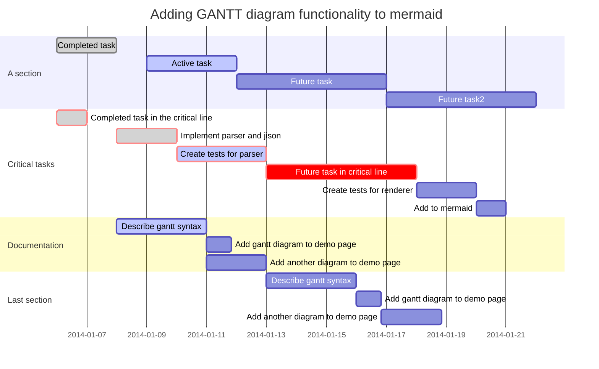
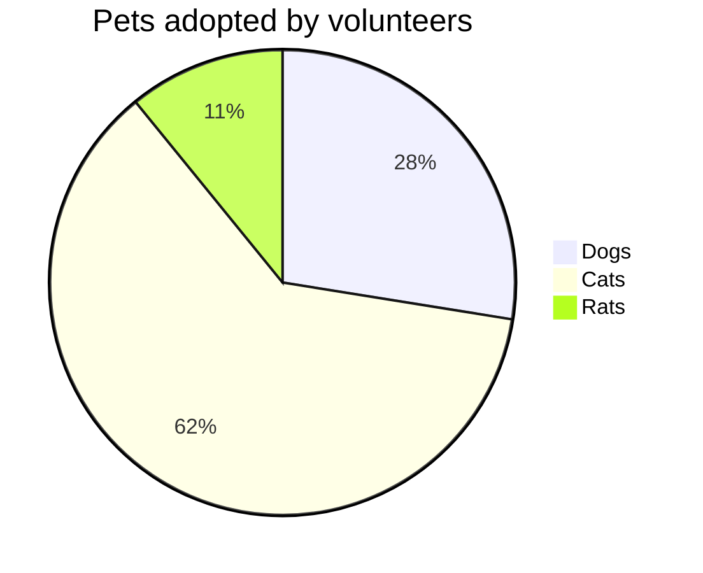

# 空格

```python

一个(non-breaking space) &nbsp;    或    &#160;     或      &#xA0;
两个(en space) &ensp;     或    &#8194;   或      &#x2002;
四个(em space) &emsp;    或    &#8195;   或      &#x2003;
细空格(thin space) &thinsp;   或     &#8201;  或      &#x2009;
```


# Flowchart

# sequence diagram

# class diagram

# state diagram

# gannt




# pie chart



