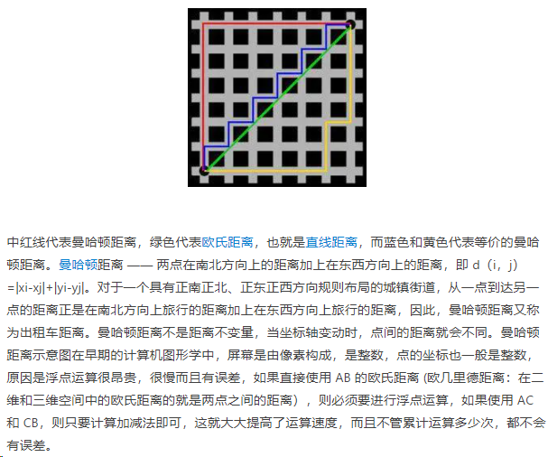
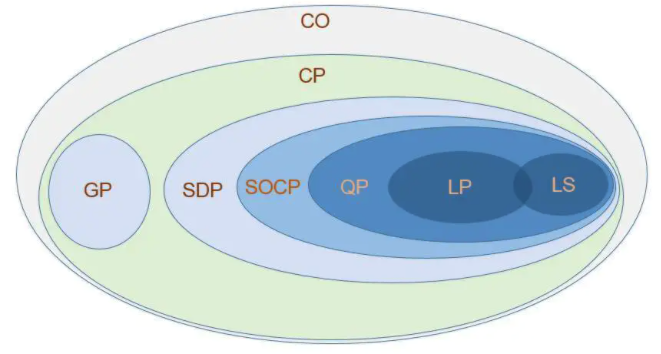
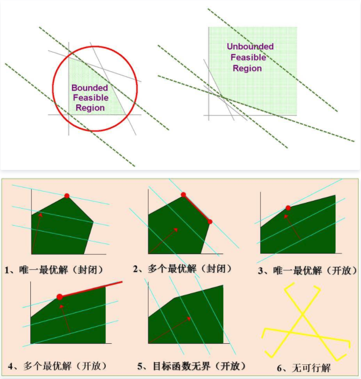

<head>
    
    
</head>

# 前言

为什么要学习凸优化？
机器学习、深度学习本身就是一种优化问题的解决方案，以优化的视角去看ML、DL 会能够看得更加透彻、清晰。能够根据实际的问题更加具体分析。

凸优化是为了解决深度学习中什么问题？

凸优化解决了机器学习中的什么问题？

自己的学习顺序的问题？
先搭设凸优化理论，再搭设最优化理论，最后上升到前沿优化。
利用convex optimization作为凸优化理论框架的基础。

## 子空间的定义

W为线性空间V的非空子集，则W是V的子空间的充要条件是：
1、若$\alpha ,\beta \in W$,则$\alpha + \beta \in W$;
2、若$\alpha \in W , k \in R,则 \ k\alpha \in W$

$\color{Blue}体现封闭性？$

什么是线性空间？即对于加法和数乘封闭的向量的一个集合！所以对向量的线性组合（加法和数乘）封闭就是线性空间。

[^对子空间的理解]: https://www.zhihu.com/question/48849797

## 正定、半正定

[^正定、半正定]: https://blog.csdn.net/a493823882/article/details/80614730)
[^理解与性质]: https://blog.csdn.net/asd136912/article/details/79146151

## 纺射组合

[^数学分析中的纺射组合]: https://blog.csdn.net/phoenix198425/article/details/79290024
[^辅助理解]: http://www.voidcn.com/article/p-bglttqaw-sr.html

# 引论

#### **1.01 最优化方法一般形式**

$minf(x) \\ s.t. x \in X$
$x\in R^n$决策变量 f(x)是目标函数，$x \sub R^n$约束集合
如果$x = R^n$则最优化问题称为无约束最优化问题

#### **1.02 约束最优化问题通常写法**

$min \ f(x) \\ \begin{align} s.t \ c_i(x) & = 0,i \in E \\ c_i(x) &\ge 0 , i \in I\end{align} $

#### **1.03 不同问题的解法**

目标与约束函数均为线性函数时，称为线性规划。目标函数和约束函数有一个是变量x的时候，称为非线性规划。

根据决策变量、目标函数和要求的不同，划分为整数规划、动态规划、网络规划、非光滑规划、随机规划、几何规划、多目标规划。

## 数学基础

### 范数

#### **1.04 定义**

范数是矢量空间内所有矢量赋予非零的正长度或大小。
-映射，范数，能够引出两个向量的距离的定义。

包括向量范数和矩阵范数：
向量范数：表征向量空间中向量的大小  -向量的长度
矩阵范数：表征矩阵引起变化的大小

#### 1.05 L1与L2

L1正则是指权值向量w中各个元素的绝对值之和（曼哈顿距离）

L2正则是指权值向量w中各个元素的平方和然后再求平方根（欧式距离）

## 凸集与凸函数

## 无约束问题的最优性条件

## 最优化方法的结构

# 无约束最优化

：牛顿法、共轭梯度法、拟牛顿法、非二次模型最优化方法、非线性最小二乘问题

# 约束最优化：

# 无限制优化

# 线性规划

# 非线性有限制规划

# 一步步走向锥规划（CP）-LS

# 一步步走向锥规划-LP

## 凸优化分类

一般来说凸优化(Convex Optimization, CO)中最一般的是锥规划 (Cone Programming, CP)问题。

凸优化(Convex Optimization, CO)
锥规划 (Cone Programming, CP)
几何规划法（Geometric Programming,GP）
半定规划（SDP-Semi-Definite Programming，SDP）
二阶锥规划(Second-Order Cone Programming,SOCP)
二次规划法（Quadratic Programming,QP）
线性规划（Linear Programming, LP）
最小二乘（Least Square, LS）

## 发展历史

彼得堡学派：由切比雪夫（ChebyShev）一手开创，马尔可夫、李亚普诺夫都是他的学生。

犹太俄罗斯数学家Kantorovich受此学派极大影响，对一般性线性规划进行了归纳，并且最先提出了解法。 从此线性规划最先走向了经济领域，走向了世界。

在Kantorovich提出线性规划的问题之后， 美国数学家Dantzig在1947年提出了单纯形算法（Simplex），Dantzig是来自波兰的美国数学家。

之后，Fiacco 和 McCormick在60年代提出了早期的插值算法（interior-point methods, IPM）， 到了70年代， 人们又提出了椭面法（ellipsoid method）， 和一些subgradient methods。Ellipsoid 算法最大意义是首次提出多项式时间（polynomial-time）的算法，但是实际上这些方法都不如Simplex算法好用，Simplex算法被称为20世纪10大算法之一。
直到1984年来自印度的数学家Karmarkar提出了多项式时间（polynomial-time）的插值点算法（interior-point methods, IPM)， 一下子改变了Simplex一家独大的状态。Karmarkar就是来自传说中的IIT（Indian insitute of Technology 印度理工学院）的。从此interior-point methods慢慢和Simplex算法并肩成为主流， 并且Simplex属于LP专业定制，很难扩展， 而Karmarkar的算法后来扩展到了非线性（nonlinear）问题中继续使用。

因此LP算法主流主要是Dantzig的Simplex和Karmarkar的IPM算法:
1994 Simplex Method：大部分中小规模问题超快，大规模问题不如IPM，偶尔情况很差。
1984 Interior-point Method, IPM：大规模情况比较快，中小规模不如Simplex， 但是不会出现最坏情况。

## 标准解法

##### 001 LP标准形式

$ \begin{align} maximize \ &c^Tx \\ &Ax \le h \\ &x \ge 0 \end{align} $

##### 002 目标函数为线性函数

可以只需要考虑凸区域的最值点即可

有三种情况：

空集：无解

有限集合区域：1、有最优解；2、有无数解

无限集合区域：1、有最优解；2、有无数解；3、无最优解==为什么会有无最优解==

##### 003 带权求和的几何意义

纺射求和：$\sum_{i=1}^p\lambda_i = 1$

锥求和：所有常数非负

凸求和：同时满足纺射求和与锥求和

##### 003 角问题

我们可以通过角来初步判断最值情况

角只能是自己和自己的凸求和，或者角不是任何其他两个点的凸求和。

如果一个点可以表示成两个点的凸求和， 那么这个点就不是角。

##### 000 什么是LADR

000 纺射空间的定义

一个仿射空间就是一个点集X和一个向量集V（X和V维度相同），它满足以下公理： 
（1）对所有 x∈X 和 u,v∈V ，满足 x+(u+v)=(x+u)+v 。即translation复合后作用于x等价于两个translation分别作用于x 
（2）对所有 x∈X ， x+0=x ，即x加上0向量等于其自身 
（3）对所有 x∈X ，如果存在 v∈V ，使得 x+v=x ，则 v=0 
（4）对所有的 x，y∈X ，存在一个 v∈V ，使得 y=x+v

##### 004 LADR转为LP问题

##### 005LP的几何意义

## Simplex 算法概述

##### 000 基本思想

从任意一个顶角出发，它的终点就是最优解

##### 000 为什么不能遍历所有的角（证明）

 

## 应用-最速下降法

[番外篇(1)——最速下降法](https://zhuanlan.zhihu.com/p/23776390)

## 对偶问题

# 一步步走向锥规划-QP

## 求解历史

Joseph-Louis Lagrange 拉格朗日是变分法（calculus of variations）的建立者之一， 变分法是自微积分发明以后一个重大突破， 对应到离散算法领域， 动态规划（dynamic programming）可以看成是一种变分法。  拉格朗日出生于意大利政府官员家庭， 但是他爸本该留下大笔财富，但是却经营不善， 家道衰落。 于是他爸想让他成为律师， 他从小最喜欢的课程是拉丁文， 对几何有点厌恶。 直到17岁， 他读了天文学家Edmond Halley 哈雷的一片论文， 发现里面有些地方看不完全明白， 就这样迷上了数学， 然后整整1年沉浸在数学之中， 1年后， 他由于数学才华， 而被本地公爵任命为助理教师， 来给部队讲解如何应用Leonhard Euler欧拉的学术来研究弹道理论（ballistics theories）。 从此一发不可收拾踏上微积分的不归路。拉格朗日后期的成就离不开与欧拉的广泛交流和提拔。

这次描述的二次规划， 简直就是见证拉格朗日奇迹的旅程。 不管是内值法（interior point），增强拉格朗日法， 还是对偶问题（duality）都离不开拉格朗日。 

在1940年左右（1939年 Leonid Kantorovich 总结发表了线性规划）， 线性规划LP被提出来， 10年后， QP作为Non-Linear Programming, NLP被总结发表。

## 二次规划

二次规划就是把一次规划的目标函数拓展到了二次函数

##### 001 目标函数

$minimize \ x^TQx +  c^Tx \\ \qquad \qquad \quad Ax \le b$

##### 000 Active set strategies基本思想

先找到一个feasible solution,然后沿着边或角继续找可行解，但LP的最优解在角上，而QP不是。并且如果QP对应的不是凸问题（non-convex），那么Active set可能只能找到一个局部最优（local optimum）。

# 参考文献

[^最优化理论]: 《最优化理论与方法》袁亚湘
[^introduction to optimization]: 《An introduction to optimization》Edwin K. P. Chong and Stanislaw H. Zak 2013
[^一步一步走向锥规划 - LP]:https://www.jianshu.com/p/0aed14be0c35
[^一步一步走向锥规划 - QP]:https://www.jianshu.com/p/bbc0df92c5d4
[^凸优化]:Convex Optimization

