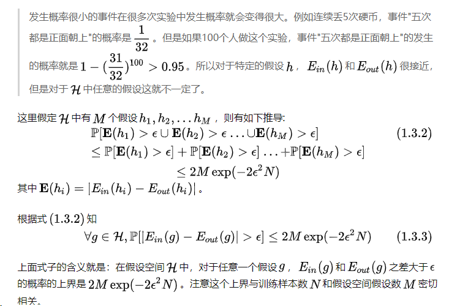

用数学工具去分析具体的机器学习、深度学习问题

# 可学性

# 复杂度的刻画

##### 符号说明与学习过程

##### hoeffding不等式

##### 为什么？

##### 可学性的两个基本条件

##### 对分

##### 增长函数

##### 打散

##### break point

vc界

##### vc维的定义

##### 增长函数的上界

# 泛化能力

# 稳定性

##### 训练集两种扰动

三种常见风险

三者之间的关系

# 一致性

一致性是用来解决什么问题的？

泛化风险

贝叶斯最优分类器

贝叶斯分类器与一般分类器之间的关系

学习算法的一致性

实值函数的

替代函数

划分机制

划分机制的一致性

# 收敛率

收敛域讨论的问题

##### 常用优化算法

零阶算法：

一阶：

二阶：

刻画优化算法的性能：

##### 对于凸函数的补充

神经网络的目标就是为损失函数找到一个最小的点，本质上是一个优化问题，而目前为止，我们所能完全解决的便是凸优化。

# 遗憾界

