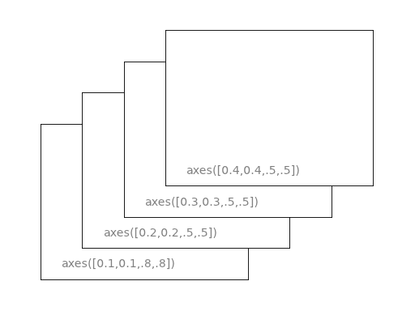
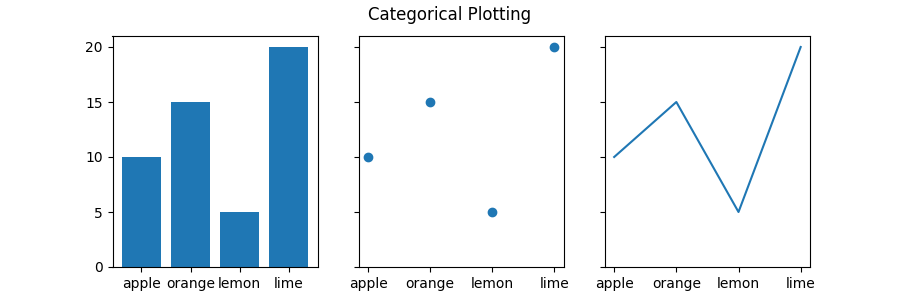
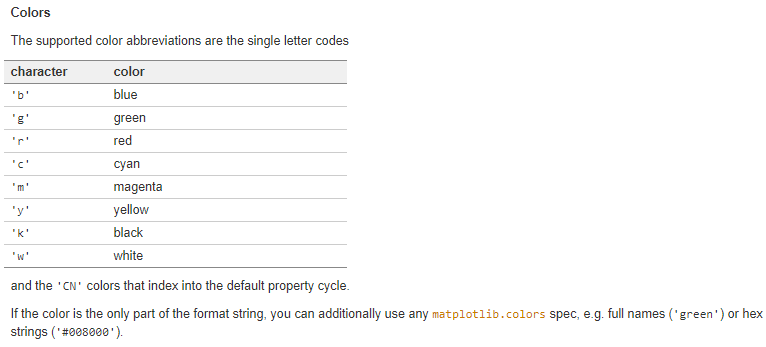

matplotlib是绘图主力，需要画图了，就查找[matplotlib](https://matplotlib.org/gallery/index.html),写完之后及时总结。


# 绘图框架

## 绘图基础

### 库的导入

```python
import matplotlib.pyplot as plt
from matplotlib.collections import EventCollection
import numpy as np
```

### 取样点与函数

```
x = np.linspace(0,10,1000)
y = np.sin(x)
z = np.cos(x**2)
```

### 对轴打标签

```
# 在绘图的时候进行，可以设定标签、颜色、线宽、线形，有位置要求
plt.plot(x,y,"b--",label="$sin(x)$",color="red",linewidth=2)
#对x轴、y轴以及图例的标签，设置x的范围
plt.xlabel("time(s)")
plt.ylabel("volt")
plt.title("First Example")
plt.xlim(0,10)
plt.legend(loc="lower left")
```

### Figure


Figure是大画版，axes是一套坐标轴。在一个 figure 当中，每添加一次 subplot ，其实就是添加了一套坐标轴，也就是添加了一个 axes。**Axis**的意义为真正的坐标轴。

图窗（Figure）

```
fig = plt.figure()
```

subplot

plt.subplot(行数，列数，序号)，序号从1开始

默认为一个

```python
ax = plt.subplot(221)
ax = plt.subplot(2,2,1)

ax2=plt.subplot(222, frameon=False)
plt.delaxes(ax2)
plt.subplot(ax2)
```


轴域(Axes)



plt.sca(选择的轴域)

```
plt.figure(1) #图表一
plt.figure(2) #图表二

#下面在图表二中进行绘制
ax1 = plt.subplot(211)
ax2 = plt.subplot(212)

x=np.linspace(0,3,100)
for i in range(5):
    plt.figure(1)#选择表格一
    ax3 = plt.subplot(211)
    ax4 = plt.subplot(212)
    plt.plot(x,np.exp(i*x/3))
    plt.sca(ax1)
    plt.plot(x,np.sin(i*x))
    plt.sca(ax2)
    plt.plot(x,np.cos(i*x))
    plt.sca(ax4)
    plt.plot(x,np.exp(i*x/4))
    plt.sca(ax3)
    plt.plot(x,np.sin(x))
plt.show()
```

## 实现的

### 条状图

```
name_list=("a","b","c","d","e","f")
random.seed("202010")
value_list = np.random.randint(0,99,size=len(name_list))
pos_list=np.arange(len(name_list))
plt.barh(pos_list,value_list,color='.50',align='center')
plt.yticks(pos_list,name_list)
plt.show()
```

饼状图

```
data = np.random.randint(1,11,5)
plt.pie(data,explode=[0,0,0.2,0,0],labels=["a","b","c","d","e"],autopct='%1.1f%%')
plt.axis('equal')
plt.show()
```


##### 001 常规区域

##### 001属性

frameon

projection

sharex

facecolor

##### 002 跨区域

用GradSpec设置网格的行数和列数，子图布局参数（例如，左，右等）可以选择性调整。
subplot2grid，一个辅助函数，类似于pyplot.subplot，但是使用基于 0 的索引，并可使子图跨越多个格子。

```python
ax1 = plt.subplot2grid((3,3), (0,0), colspan=3)
ax2 = plt.subplot2grid((3,3), (1,0), colspan=2)
ax3 = plt.subplot2grid((3,3), (1, 2), rowspan=2)
ax4 = plt.subplot2grid((3,3), (2, 0))
ax5 = plt.subplot2grid((3,3), (2, 1))
```

```python
gs = gridspec.GridSpec(3, 3)
ax1 = plt.subplot(gs[0, :])
ax2 = plt.subplot(gs[1,:-1])
ax3 = plt.subplot(gs[1:, -1])
ax4 = plt.subplot(gs[-1,0])
ax5 = plt.subplot(gs[-1,-2])
```

两种方法来实现跨区域，第二种方法要注意-1是最后一块，使用:-1时候，不包括-1。如果子图重叠了的话，会自动融合。

##### 003 调整参数布局

```python
gs1 = gridspec.GridSpec(3, 3)
gs1.update(left=0.05, right=0.48, wspace=0.05)
#网格尺寸可变，你可以调整行和列的相对高度和宽度，要注意绝对高度值是无意义的，有意义的只是它们的相对比值。
gs = gridspec.GridSpec(2, 2,
                       width_ratios=[1,2],
                       height_ratios=[4,1]
                       )
ax1 = plt.subplot(gs[0])
ax2 = plt.subplot(gs[1])
ax3 = plt.subplot(gs[2])
ax4 = plt.subplot(gs[3])
```

## 刻度与标签


## 轴(axis)

```
ax.set(xlim=(xmin, xmax), ylim=(ymin, ymax))
#用数列的方法赋值
fig = plt.figure()
plt.axis([0, 10, 0, 10])
```

极坐标

Hammer

Aitoff

Lamber

Mollwede

polar

改变上下限

```python
#设置横轴、纵轴的上下限
xlim(-4.0,4.0)
ylim(-1.0,1.0)

# 设置横轴、纵轴记号
xticks(np.linspace(-4,4,9,endpoint=True))
yticks(np.linspace(-1,1,5,endpoint=True))

# 以分辨率 72 来保存图片
savefig("exercice_2.png",dpi=72)
```

轴的坐标

```python
axes([0.1,0.1,.8,.8]) #前两个为坐标，后面为宽度与长度
xticks([]), yticks([])
text(0.6,0.6, 'axes([0.1,0.1,.8,.8])',ha='center',va='center',size=20,alpha=.5) #文字
```

xticks

```python
x = [1, 2, 3, 4]
y = [1, 4, 9, 6]
labels = ['Frogs', 'Hogs', 'Bogs', 'Slogs']

plt.plot(x, y)
plt.xticks(x, labels, rotation='vertical') #改变每个x坐标轴的标签，可以进行旋转
plt.margins(0.2)
plt.subplots_adjust(bottom=0.15)
plt.show()
```

## 图脊(spines)

 是连接轴刻度标记的线，而且标明了数据区域的边界。 他们可以被放置在任意位置。直到现在，他们仍是轴的边界。
我们将要改变现状，因为我们想要spines 置于中间。因为有四个spine（上下左右），我们将要通过设置颜色（无）丢弃上面和右侧的部分。 进而我们移动下面和左边的线到坐标0（数据空间）。


```python
import matplotlib.pyplot as plt
import numpy as np


fig, ax = plt.subplots()
# Move the left and bottom spines to x = 0 and y = 0, respectively.
ax.spines["left"].set_position(("data", 0))
ax.spines["bottom"].set_position(("data", 0))
# Hide the top and right spines.
ax.spines["top"].set_visible(False)
ax.spines["right"].set_visible(False)

# Draw arrows (as black triangles: ">k"/"^k") at the end of the axes.  In each
# case, one of the coordinates (0) is a data coordinate (i.e., y = 0 or x = 0,
# respectively) and the other one (1) is an axes coordinate (i.e., at the very
# right/top of the axes).  Also, disable clipping (clip_on=False) as the marker
# actually spills out of the axes.
ax.plot(1, 0, ">k", transform=ax.get_yaxis_transform(), clip_on=False)
ax.plot(0, 1, "^k", transform=ax.get_xaxis_transform(), clip_on=False)

# Some sample data.
x = np.linspace(-0.5, 1., 100)
ax.plot(x, np.sin(x*np.pi))

plt.show()
```

https://www.runoob.com/w3cnote/matplotlib-tutorial.html

## 网格（grid）

## 图例(legend)

##### 001 自动调用

是会自动搜索和放置图例的，可以在plot函数中使用label属性，也可以对plot对象调用方法。

```
line, = ax.plot([1, 2, 3], label='Inline label')
ax.legend()

line, = ax.plot([1, 2, 3])
line.set_label('Label via method')
ax.legend()
```

##### 002 对已经存在的元素加图例/排除图例


##### 003 可选参数

图例居中

图例阴影

字体大小

```
legend = ax.legend(loc='upper center', shadow=True, fontsize='x-large')
```


##### 004 图框颜色

```
legend.get_frame().set_facecolor('C0')
```


## 存储与显示操作

### imsave

### imshow

## 注写

### 轴中文字

```
fig = plt.figure()
plt.text(4, 1, t, ha='left', rotation=15, wrap=True)
```

坐标、文字t，，旋转、溢出

### 图中文字

##### 004 实现Latex

## 数据

如何生成数据是一件十分关键的工作。

##### 001 自变量的生成

x = np.linspace(-np.pi,np.pi,256,endpoint=True)

##### 002 应变量的对应

c,s = np.cos(x),np.sin(x)

##### 003 利用字典的方式来存储数据



##### 004 随机数

```python
np.random.seed(19680801)
xdata = np.random.random([2, 10])
# split the data into two parts
xdata1 = xdata[0, :]
xdata2 = xdata[1, :]
# sort the data so it makes clean curves
xdata1.sort()
xdata2.sort()
# create some y data points
ydata1 = xdata1 ** 2
ydata2 = 1 - xdata2 ** 3
```


# 自己动手实践

## 线图

### 柱状图

### 蜡烛图

### 折线图

### 曲线图

errorbar
附有误差的线

绘制两条曲线，然后使用EventCollections标记每个曲线在相应轴上的x和y数据点的位置。


```
import mathplotlib.polt as plt
data = random.random(2,2)
xdata1 = data[1,:]
xdata2 = data[2,:]
ydata1 = data**2
ydata2 = 1-data**3

collects_1 = Eventcollection(xdata1,color='tab:bule',linewight=1.05)
collects_2 = Eventcollection(xdata2,color='tab:red',linewight=1.05)
collects_3 = Eventcollection(ydata1,color='tab:bule',linewight=1.05)
collects_4 = Eventcollection(ydata2,color='tab:red',linewight=1.05)

ax = plt.subplot(111)
ax.add(collect_1)

```


### 分组

### 横放

### 有间断

## 图形与图片


## 点图


```python
import numpy as np
import matplotlib.pyplot as plt

n = 1024
X = np.random.normal(0,1,n)
Y = np.random.normal(0,1,n)
T = np.arctan2(Y,X)

plt.axes([0.025,0.025,0.95,0.95])
plt.scatter(X,Y, s=75, c=T, alpha=.5)

plt.xlim(-1.5,1.5), plt.xticks([])
plt.ylim(-1.5,1.5), plt.yticks([])
plt.show()

```


## 三维图

## 文本

```

```


## 饼图和极坐标图

### 3D图

### 


## 动画


# Pyplot

### annotate

```
matplotlib.pyplot.annotate(text, xy, *args, **kwargs)
```


### plot

##### 001 plt.plot( )

plot(x坐标、y坐标、)

可以改变颜色、线条类型、宽度、
color = 'yellow',linestyle = '-',linewidth = '20'

##### 002 线的类型

```python
fmt = '[marker][line][color]'
```




##### 006 可选参数表

https://matplotlib.org/api/_as_gen/matplotlib.pyplot.plot.html#matplotlib.pyplot.plot

### plt.fill_between/fill_between 

##### 001 填充

填充两条水平/垂直曲线直接的区域


##### 002 颜色与透明


##### 003 充填范围

利用interperation来控制区域

超出限制的转换


### arrow


### gca


```python
import matplotlib.pyplot as plt

data = {'apple': 10, 'orange': 15, 'lemon': 5, 'lime': 20}
names = list(data.keys())
values = list(data.values())

fig, axs = plt.subplots(1, 3, figsize=(9, 3), sharey=True)
axs[0].bar(names, values)
axs[1].scatter(names, values)
axs[2].plot(names, values)
fig.suptitle('Categorical Plotting')
```


# 基本概念

使用Figure.add_subplot来添加一个三维子图

```python
import matplotlib.pyplot as plt
fig = plt.figure()
ax = fig.add_subplot(111, projection='3d')
```

## plots平面

## scatter 坐标尺度

# 折线图

```python
import matplotlib as mpl
from mpl_toolkits.mplot3d import Axes3D
import numpy as np
import matplotlib.pyplot as plt
 
mpl.rcParams['legend.fontsize'] = 10
 
fig = plt.figure()
ax = fig.gca(projection='3d')
theta = np.linspace(-4 * np.pi, 4 * np.pi, 100)
z = np.linspace(-2, 2, 100)
r = z ** 2 + 1
x = r * np.sin(theta)
y = r * np.cos(theta)
ax.plot(x, y, z, label='parametric curve')
ax.legend()
 
plt.show()
```


# 散点图

```python
from mpl_toolkits.mplot3d import Axes3D
import matplotlib.pyplot as plt
import numpy as np
 
 
def randrange(n, vmin, vmax):
    '''
    Helper function to make an array of random numbers having shape (n, )
    with each number distributed Uniform(vmin, vmax).
    '''
    return (vmax - vmin) * np.random.rand(n) + vmin
 
 
fig = plt.figure()
ax = fig.add_subplot(111, projection='3d')
 
n = 100
 
# For each set of style and range settings, plot n random points in the box
# defined by x in [23, 32], y in [0, 100], z in [zlow, zhigh].
for c, m, zlow, zhigh in [('r', 'o', -50, -25), ('b', '^', -30, -5)]:
    xs = randrange(n, 23, 32)
    ys = randrange(n, 0, 100)
    zs = randrange(n, zlow, zhigh)
    ax.scatter(xs, ys, zs, c=c, marker=m)
 
ax.set_xlabel('X Label')
ax.set_ylabel('Y Label')
ax.set_zlabel('Z Label')
 
plt.show()
```


# 线框图

```python
from mpl_toolkits.mplot3d import axes3d
import matplotlib.pyplot as plt
 
fig = plt.figure()
ax = fig.add_subplot(111, projection='3d')
 
# Grab some test data.
X, Y, Z = axes3d.get_test_data(0.05)
 
# Plot a basic wireframe.
ax.plot_wireframe(X, Y, Z, rstride=10, cstride=10)
 
plt.show()
```

# 表面图

```python
from mpl_toolkits.mplot3d import Axes3D
import matplotlib.pyplot as plt
from matplotlib import cm
from matplotlib.ticker import LinearLocator, FormatStrFormatter
import numpy as np
 
fig = plt.figure()
ax = fig.gca(projection='3d')
 
# Make data.
X = np.arange(-5, 5, 0.25)
Y = np.arange(-5, 5, 0.25)
X, Y = np.meshgrid(X, Y)
R = np.sqrt(X ** 2 + Y ** 2)
Z = np.sin(R)
 
# Plot the surface.
surf = ax.plot_surface(X, Y, Z, cmap=cm.coolwarm,
                       linewidth=0, antialiased=False)
 
# Customize the z axis.
ax.set_zlim(-1.01, 1.01)
ax.zaxis.set_major_locator(LinearLocator(10))
ax.zaxis.set_major_formatter(FormatStrFormatter('%.02f'))
 
# Add a color bar which maps values to colors.
fig.colorbar(surf, shrink=0.5, aspect=5)
 
plt.show()
```

# 柱形图

```python
from mpl_toolkits.mplot3d import Axes3D
import matplotlib.pyplot as plt
import numpy as np
 
fig = plt.figure()
ax = fig.add_subplot(111, projection='3d')
for c, z in zip(['r', 'g', 'b', 'y'], [30, 20, 10, 0]):
    xs = np.arange(20)
    ys = np.random.rand(20)
 
    # You can provide either a single color or an array. To demonstrate this,
    # the first bar of each set will be colored cyan.
    cs = [c] * len(xs)
    cs[0] = 'c'
    ax.bar(xs, ys, zs=z, zdir='y', color=cs, alpha=0.8)
 
ax.set_xlabel('X')
ax.set_ylabel('Y')
ax.set_zlabel('Z')
 
plt.show()
```

# 箭头图

```python
from mpl_toolkits.mplot3d import axes3d
import matplotlib.pyplot as plt
import numpy as np
 
fig = plt.figure()
ax = fig.gca(projection='3d')
 
# Make the grid
x, y, z = np.meshgrid(np.arange(-0.8, 1, 0.2),
                      np.arange(-0.8, 1, 0.2),
                      np.arange(-0.8, 1, 0.8))
 
# Make the direction data for the arrows
u = np.sin(np.pi * x) * np.cos(np.pi * y) * np.cos(np.pi * z)
v = -np.cos(np.pi * x) * np.sin(np.pi * y) * np.cos(np.pi * z)
w = (np.sqrt(2.0 / 3.0) * np.cos(np.pi * x) * np.cos(np.pi * y) *
     np.sin(np.pi * z))
 
ax.quiver(x, y, z, u, v, w, length=0.1, normalize=True)
 
plt.show()
```

# 2D转3D

```python
from mpl_toolkits.mplot3d import Axes3D
import numpy as np
import matplotlib.pyplot as plt
 
fig = plt.figure()
ax = fig.gca(projection='3d')
 
# Plot a sin curve using the x and y axes.
x = np.linspace(0, 1, 100)
y = np.sin(x * 2 * np.pi) / 2 + 0.5
ax.plot(x, y, zs=0, zdir='z', label='curve in (x,y)')
 
# Plot scatterplot data (20 2D points per colour) on the x and z axes.
colors = ('r', 'g', 'b', 'k')
x = np.random.sample(20 * len(colors))
y = np.random.sample(20 * len(colors))
labels = np.random.randint(3, size=80)
 
# By using zdir='y', the y value of these points is fixed to the zs value 0
# and the (x,y) points are plotted on the x and z axes.
ax.scatter(x, y, zs=0, zdir='y', c=labels, label='points in (x,z)')
 
# Make legend, set axes limits and labels
ax.legend()
ax.set_xlim(0, 1)
ax.set_ylim(0, 1)
ax.set_zlim(0, 1)
ax.set_xlabel('X')
ax.set_ylabel('Y')
ax.set_zlabel('Z')
 
# Customize the view angle so it's easier to see that the scatter points lie
# on the plane y=0
ax.view_init(elev=20., azim=-35)
 
plt.show()
```

# 文本图

```python
from mpl_toolkits.mplot3d import Axes3D
import matplotlib.pyplot as plt
 
 
fig = plt.figure()
ax = fig.gca(projection='3d')
 
# Demo 1: zdir
zdirs = (None, 'x', 'y', 'z', (1, 1, 0), (1, 1, 1))
xs = (1, 4, 4, 9, 4, 1)
ys = (2, 5, 8, 10, 1, 2)
zs = (10, 3, 8, 9, 1, 8)
 
for zdir, x, y, z in zip(zdirs, xs, ys, zs):
    label = '(%d, %d, %d), dir=%s' % (x, y, z, zdir)
    ax.text(x, y, z, label, zdir)
 
# Demo 2: color
ax.text(9, 0, 0, "red", color='red')
 
# Demo 3: text2D
# Placement 0, 0 would be the bottom left, 1, 1 would be the top right.
ax.text2D(0.05, 0.95, "2D Text", transform=ax.transAxes)
 
# Tweaking display region and labels
ax.set_xlim(0, 10)
ax.set_ylim(0, 10)
ax.set_zlim(0, 10)
ax.set_xlabel('X axis')
ax.set_ylabel('Y axis')
ax.set_zlabel('Z axis')
 
plt.show()
```

# 3D拼图

```python
import matplotlib.pyplot as plt
from mpl_toolkits.mplot3d.axes3d import Axes3D, get_test_data
from matplotlib import cm
import numpy as np
 
# set up a figure twice as wide as it is tall
fig = plt.figure(figsize=plt.figaspect(0.5))
 
# ===============
#  First subplot
# ===============
# set up the axes for the first plot
ax = fig.add_subplot(1, 2, 1, projection='3d')
 
# plot a 3D surface like in the example mplot3d/surface3d_demo
X = np.arange(-5, 5, 0.25)
Y = np.arange(-5, 5, 0.25)
X, Y = np.meshgrid(X, Y)
R = np.sqrt(X ** 2 + Y ** 2)
Z = np.sin(R)
surf = ax.plot_surface(X, Y, Z, rstride=1, cstride=1, cmap=cm.coolwarm,
                       linewidth=0, antialiased=False)
ax.set_zlim(-1.01, 1.01)
fig.colorbar(surf, shrink=0.5, aspect=10)
 
# ===============
# Second subplot
# ===============
# set up the axes for the second plot
ax = fig.add_subplot(1, 2, 2, projection='3d')
 
# plot a 3D wireframe like in the example mplot3d/wire3d_demo
X, Y, Z = get_test_data(0.05)
ax.plot_wireframe(X, Y, Z, rstride=10, cstride=10)
 
plt.show()
```


# Collection

# 参考