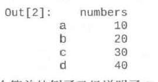

pd有点类似于数据库

# 展示信息

```python
df.head(10)
df.info()
type(df[1])
df.dtypes

from pandas.api.types import is_string_dtype
from pandas.api.types import is_numeric_dtype
from pandas.api.types import is_timedelta64_dtype
is_string_dtype(df[1])

#排序
.sort_index()方法在指定轴上根据索引进行排序，默认升序
.sort_index(axis=0, ascending=True)
```

# DataFrame 类

DataFrame 类设计用来管理具有索引和标签的数据

创立

```python
df = pd.DtaFrame([10,20,30,40].columns=['numbers'],index=['a','b','c','d'])
```



获取各种属性

```python
dfname._stat_axis.values.tolist() # 行名称
dfname.columns.values.tolist()    # 列名称
```

索引

处理缺漏

# Series类

# 数据的透视

对数据的连接处理

con