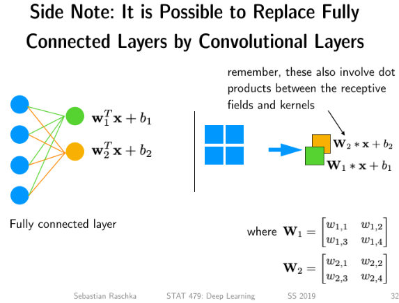
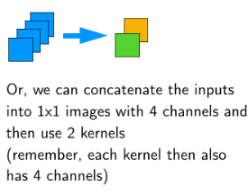

## Reinitialize weights using He initialization

```python
for m in self.modules():
	if isinstance(m, torch.nn.Conv2d):
        nn.init.kaiming_normal_(m.weight.detach())
        m.bias.detach().zero_()
	elif isinstance(m, torch.nn.Linear):             				nn.init.kaiming_normal_(m.weight.detach())
        m.bias.detach().zero_()
```

## 使用全连接层

```python

import torch
#数字后加点表示浮点数，性质[1,1,2,2]
inputs = torch.tensor([[[[1., 2.],
                         [3., 4.]]]])
fc = torch.nn.Linear(4, 2)
weights = torch.tensor([[1.1, 1.2, 1.3, 1.4],
                        [1.5, 1.6, 1.7, 1.8]])
bias = torch.tensor([1.9, 2.0])
fc.weight.data = weights
fc.bias.data = bias
torch.relu(fc(inputs.view(-1, 4)))
conv = torch.nn.Conv2d(in_channels=1,
                       out_channels=2,
                       kernel_size=inputs.squeeze(dim=(0)).squeeze(dim=(0)).size())
print(conv.weight.size())
print(conv.bias.size())
conv.weight.data = weights.view(2, 1, 2, 2)
conv.bias.data = bias
torch.relu(conv(inputs))
conv = torch.nn.Conv2d(in_channels=4,
                       out_channels=2,
                       kernel_size=(1, 1))

conv.weight.data = weights.view(2, 4, 1, 1)
conv.bias.data = bias
torch.relu(conv(inputs.view(1, 4, 1, 1)))


```

<figure class="half">     
       
     </figure>


## 全卷积层

```python
logits = F.adaptive_avg_pool2d(out, 1)
# drop width
logits.squeeze_(-1)
# drop height
logits.squeeze_(-1)
probas = torch.softmax(logits, dim=1)
return logits, probas

torch.manual_seed(random_seed)
model = ConvNet(num_classes=num_classes)
model = model.to(device)

optimizer = torch.optim.Adam(model.parameters(), lr=learning_rate) 
```

