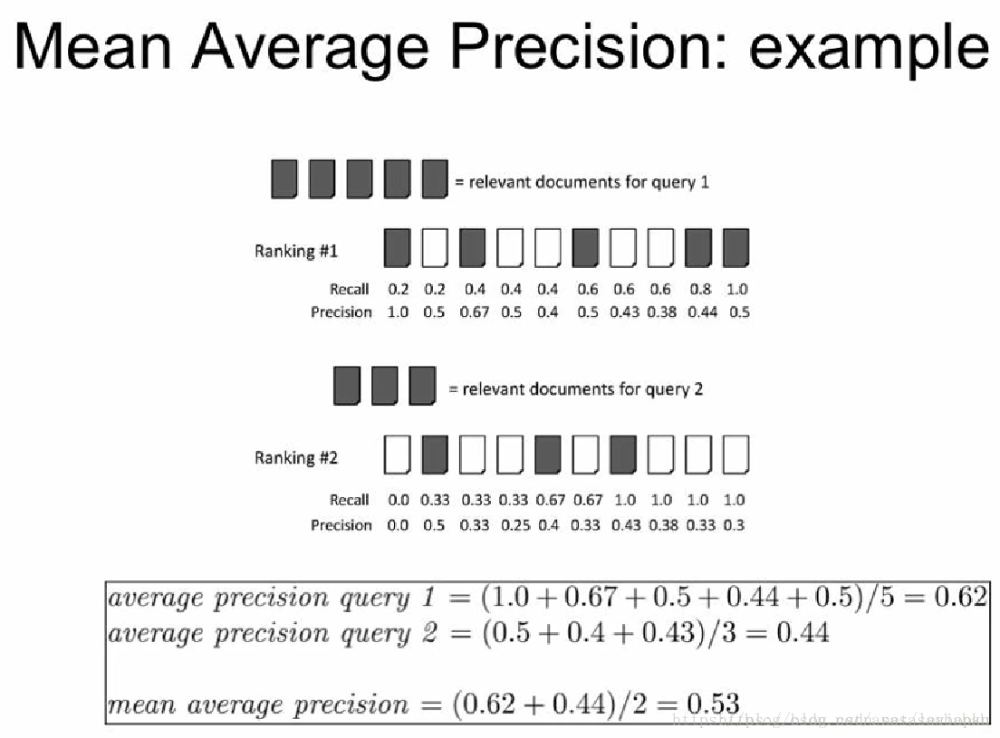

# 混淆矩阵

| 预测值\真实值 |  Positive  | Negtive  |
|  ----  | ----  | ----  |
| Positive | TP |  FP |
| Negtive  | FN |  TN |

分类正确的有两类：TP,FP

准确率(Precision)：可以理解为查准率，返回的结果中有多少是正确的

召回率(recall)：可以理解为查全率，所有正样本中找到的个数占比

acc精确度

# ROC曲线

受试者工作特征曲线 （receiver operating characteristic curve，简称ROC曲线），又称为感受性曲线（sensitivity curve）。

得此名的原因在于曲线上各点反映着相同的感受性，它们都是对同一信号刺激的反应，只不过是在几种不同的判定标准下所得的结果而已。

ROC曲线上的点，表示不同阈值时对应的FPR和TPR。阈值指预测阳性概率为多大的时候，判断为阳性。
>参考：\
><https://zhuanlan.zhihu.com/p/26293316> 
><https://zhuanlan.zhihu.com/p/25982866>

AUC = Area Under Curve

## 绘制ROC曲线

# mPA

在多个类别的检测中，算出召回率从0到1时的准确率（同一召回率取最高的准确率），计算准确率的平均值。然后对所有类别求平均就可以得到mAP了。

