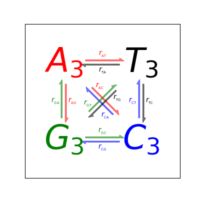

```
​```python
```

基本绘图流程：
创建一个figure，在figure上创建plotting区域，在区域上绘图，在贴上标签。

官网[API](https://matplotlib.org/api/_as_gen/matplotlib.pyplot.html#module-matplotlib.pyplot)

**arrow**
为轴添加箭头

```python
matplotlib.pyplot.arrow(x, y, dx, dy, **kwargs)
#draws an arrow from (x, y) to (x+dx, y+dy).
```

[demo](https://matplotlib.org/gallery/text_labels_and_annotations/arrow_demo.html#sphx-glr-gallery-text-labels-and-annotations-arrow-demo-py):

**figure**

**gca**`

**grid**

**imsave**

**legend**

**imshow**
显示数据为图像