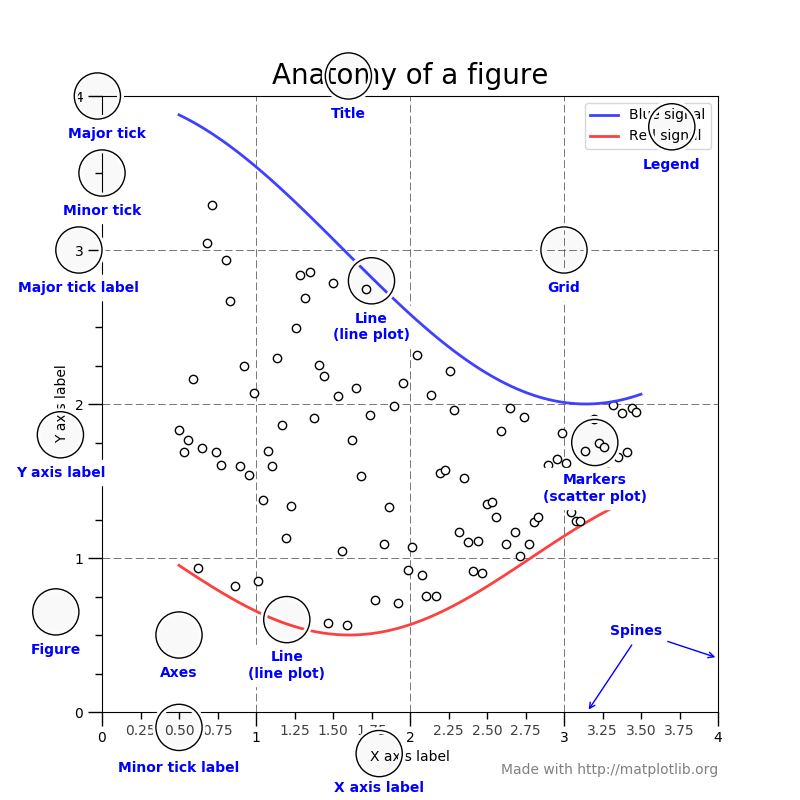
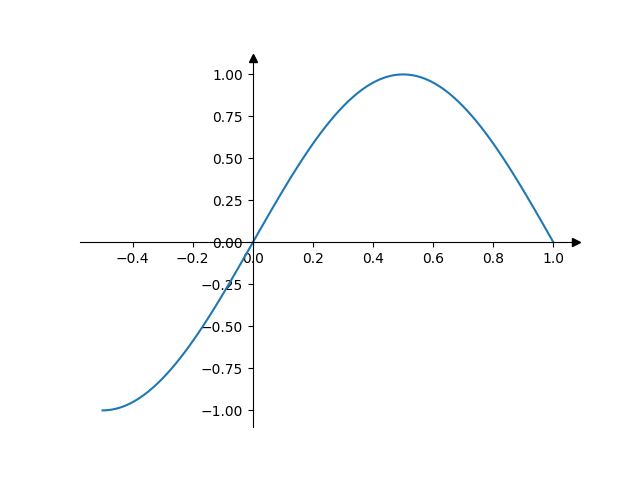
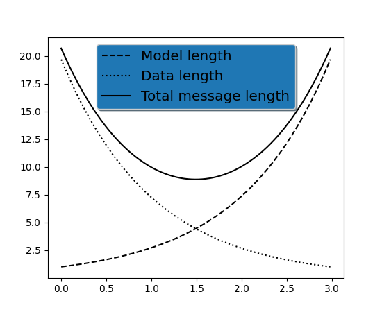
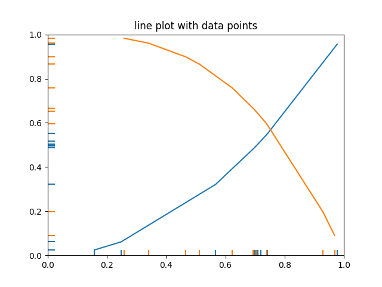
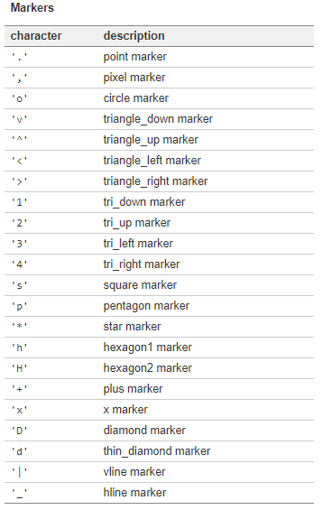

```
​```python
```

matplotlib是绘图主力，需要画图了，就查找[matplotlib](https://matplotlib.org/gallery/index.html),写完之后及时总结。

# 基本功能的实现

## 库的导入

```python
import matplotlib.pyplot as plt
from matplotlib.collections import EventCollection
import numpy as np
```


## Figure构成

绘图流程：
创建一个**figure**，在figure上创建**plotting**区域，在区域上**绘图**，再贴上**标签**。




## 图窗（Figure）

```
fig = plt.figure()
```


## 轴域(Axes)

灵活的子图 :可以自由堆叠，而不是像subplot进行对其


## 子图(subplot)

##### 001 常规区域

plt.subplot(行数，列数，序号)，序号从1开始

默认为一个

```python
ax = plt.subplot(221)
ax = plt.subplot(2,2,1)

ax2=plt.subplot(222, frameon=False)
plt.delaxes(ax2)
plt.subplot(ax2)
```

##### 001属性

frameon

projection

sharex

facecolor

##### 002 跨区域

用GradSpec设置网格的行数和列数，子图布局参数（例如，左，右等）可以选择性调整。
subplot2grid，一个辅助函数，类似于pyplot.subplot，但是使用基于 0 的索引，并可使子图跨越多个格子。

```python
ax1 = plt.subplot2grid((3,3), (0,0), colspan=3)
ax2 = plt.subplot2grid((3,3), (1,0), colspan=2)
ax3 = plt.subplot2grid((3,3), (1, 2), rowspan=2)
ax4 = plt.subplot2grid((3,3), (2, 0))
ax5 = plt.subplot2grid((3,3), (2, 1))
```

```python
gs = gridspec.GridSpec(3, 3)
ax1 = plt.subplot(gs[0, :])
ax2 = plt.subplot(gs[1,:-1])
ax3 = plt.subplot(gs[1:, -1])
ax4 = plt.subplot(gs[-1,0])
ax5 = plt.subplot(gs[-1,-2])
```

两种方法来实现跨区域，第二种方法要注意-1是最后一块，使用:-1时候，不包括-1。如果子图重叠了的话，会自动融合。

##### 003 调整参数布局

```python
gs1 = gridspec.GridSpec(3, 3)
gs1.update(left=0.05, right=0.48, wspace=0.05)
#网格尺寸可变，你可以调整行和列的相对高度和宽度，要注意绝对高度值是无意义的，有意义的只是它们的相对比值。
gs = gridspec.GridSpec(2, 2,
                       width_ratios=[1,2],
                       height_ratios=[4,1]
                       )
ax1 = plt.subplot(gs[0])
ax2 = plt.subplot(gs[1])
ax3 = plt.subplot(gs[2])
ax4 = plt.subplot(gs[3])
```

## 刻度与标签


## 轴(axis)

```
ax.set(xlim=(xmin, xmax), ylim=(ymin, ymax))
#用数列的方法赋值
fig = plt.figure()
plt.axis([0, 10, 0, 10])
```

极坐标

Hammer

Aitoff

Lamber

Mollwede

polar

改变上下限

```python
#设置横轴、纵轴的上下限
xlim(-4.0,4.0)
ylim(-1.0,1.0)

# 设置横轴、纵轴记号
xticks(np.linspace(-4,4,9,endpoint=True))
yticks(np.linspace(-1,1,5,endpoint=True))

# 以分辨率 72 来保存图片
savefig("exercice_2.png",dpi=72)
```

轴的坐标

```python
axes([0.1,0.1,.8,.8]) #前两个为坐标，后面为宽度与长度
xticks([]), yticks([])
text(0.6,0.6, 'axes([0.1,0.1,.8,.8])',ha='center',va='center',size=20,alpha=.5) #文字
```

xticks

```python
x = [1, 2, 3, 4]
y = [1, 4, 9, 6]
labels = ['Frogs', 'Hogs', 'Bogs', 'Slogs']

plt.plot(x, y)
plt.xticks(x, labels, rotation='vertical') #改变每个x坐标轴的标签，可以进行旋转
plt.margins(0.2)
plt.subplots_adjust(bottom=0.15)
plt.show()
```

## 图脊(spines)

 是连接轴刻度标记的线，而且标明了数据区域的边界。 他们可以被放置在任意位置。直到现在，他们仍是轴的边界。
我们将要改变现状，因为我们想要spines 置于中间。因为有四个spine（上下左右），我们将要通过设置颜色（无）丢弃上面和右侧的部分。 进而我们移动下面和左边的线到坐标0（数据空间）。



```python
import matplotlib.pyplot as plt
import numpy as np


fig, ax = plt.subplots()
# Move the left and bottom spines to x = 0 and y = 0, respectively.
ax.spines["left"].set_position(("data", 0))
ax.spines["bottom"].set_position(("data", 0))
# Hide the top and right spines.
ax.spines["top"].set_visible(False)
ax.spines["right"].set_visible(False)

# Draw arrows (as black triangles: ">k"/"^k") at the end of the axes.  In each
# case, one of the coordinates (0) is a data coordinate (i.e., y = 0 or x = 0,
# respectively) and the other one (1) is an axes coordinate (i.e., at the very
# right/top of the axes).  Also, disable clipping (clip_on=False) as the marker
# actually spills out of the axes.
ax.plot(1, 0, ">k", transform=ax.get_yaxis_transform(), clip_on=False)
ax.plot(0, 1, "^k", transform=ax.get_xaxis_transform(), clip_on=False)

# Some sample data.
x = np.linspace(-0.5, 1., 100)
ax.plot(x, np.sin(x*np.pi))

plt.show()
```

https://www.runoob.com/w3cnote/matplotlib-tutorial.html

## 网格（grid）

## 图例(legend)

##### 001 自动调用

是会自动搜索和放置图例的，可以在plot函数中使用label属性，也可以对plot对象调用方法。

```
line, = ax.plot([1, 2, 3], label='Inline label')
ax.legend()

line, = ax.plot([1, 2, 3])
line.set_label('Label via method')
ax.legend()
```

##### 002 对已经存在的元素加图例/排除图例


##### 003 可选参数

图例居中

图例阴影

字体大小

```
legend = ax.legend(loc='upper center', shadow=True, fontsize='x-large')
```



##### 004 图框颜色

```
legend.get_frame().set_facecolor('C0')
```


## 存储与显示操作

### imsave

### imshow

## 注写

### 轴中文字

```
fig = plt.figure()
plt.text(4, 1, t, ha='left', rotation=15, wrap=True)
```

坐标、文字t，，旋转、溢出

### 图中文字

##### 004 实现Latex

## 数据

如何生成数据是一件十分关键的工作。

##### 001 自变量的生成

x = np.linspace(-np.pi,np.pi,256,endpoint=True)

##### 002 应变量的对应

c,s = np.cos(x),np.sin(x)

##### 003 利用字典的方式来存储数据


##### 004 随机数

```python
np.random.seed(19680801)
xdata = np.random.random([2, 10])
# split the data into two parts
xdata1 = xdata[0, :]
xdata2 = xdata[1, :]
# sort the data so it makes clean curves
xdata1.sort()
xdata2.sort()
# create some y data points
ydata1 = xdata1 ** 2
ydata2 = 1 - xdata2 ** 3
```


# 自己动手实践

## 线图

### 柱状图

### 蜡烛图

### 折线图

### 曲线图

errorbar
附有误差的线

绘制两条曲线，然后使用EventCollections标记每个曲线在相应轴上的x和y数据点的位置。



```
import mathplotlib.polt as plt
data = random.random(2,2)
xdata1 = data[1,:]
xdata2 = data[2,:]
ydata1 = data**2
ydata2 = 1-data**3

collects_1 = Eventcollection(xdata1,color='tab:bule',linewight=1.05)
collects_2 = Eventcollection(xdata2,color='tab:red',linewight=1.05)
collects_3 = Eventcollection(ydata1,color='tab:bule',linewight=1.05)
collects_4 = Eventcollection(ydata2,color='tab:red',linewight=1.05)

ax = plt.subplot(111)
ax.add(collect_1)

```


### 分组

### 横放

### 有间断

## 图形与图片


## 点图


```python
import numpy as np
import matplotlib.pyplot as plt

n = 1024
X = np.random.normal(0,1,n)
Y = np.random.normal(0,1,n)
T = np.arctan2(Y,X)

plt.axes([0.025,0.025,0.95,0.95])
plt.scatter(X,Y, s=75, c=T, alpha=.5)

plt.xlim(-1.5,1.5), plt.xticks([])
plt.ylim(-1.5,1.5), plt.yticks([])
plt.show()

```


## 三维图

## 文本

```

```


## 饼图和极坐标图

### 3D图

### 


## 动画


# Pyplot

### annotate

```
matplotlib.pyplot.annotate(text, xy, *args, **kwargs)
```


### plot

##### 001 plt.plot( )

plot(x坐标、y坐标、)

可以改变颜色、线条类型、宽度、
color = 'yellow',linestyle = '-',linewidth = '20'

##### 002 线的类型

```python
fmt = '[marker][line][color]'
```




##### 006 可选参数表

https://matplotlib.org/api/_as_gen/matplotlib.pyplot.plot.html#matplotlib.pyplot.plot

### plt.fill_between/fill_between 

##### 001 填充

填充两条水平/垂直曲线直接的区域


##### 002 颜色与透明


##### 003 充填范围

利用interperation来控制区域

超出限制的转换


### arrow


### gca


```python
import matplotlib.pyplot as plt

data = {'apple': 10, 'orange': 15, 'lemon': 5, 'lime': 20}
names = list(data.keys())
values = list(data.values())

fig, axs = plt.subplots(1, 3, figsize=(9, 3), sharey=True)
axs[0].bar(names, values)
axs[1].scatter(names, values)
axs[2].plot(names, values)
fig.suptitle('Categorical Plotting')
```


# Collection

# 参考