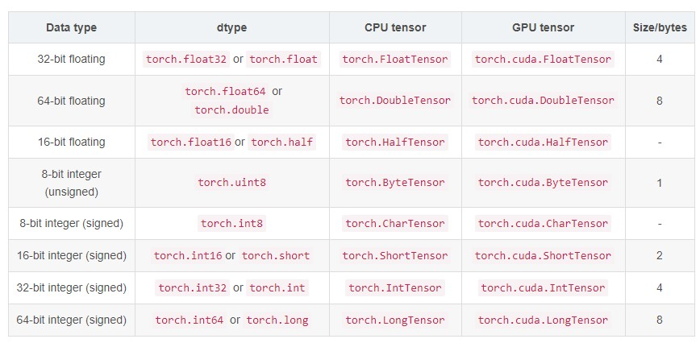

基本的模块

[torch模块](ap.md)

# 数据的准备

总共三个关键包：datasets、transforms,DataLoader、samper
从datasets导入数据，transforms将数据转换，DataLoader将数据转为dataloader对象。

## 数据的加载

### 自带数据的加载

```python
from Torchvison import datasets,transforms
x_train = datasets.fashionMNIST(root = '../datasets',train = True,transorms.ToTensor(),download = True)
```


root下载位置,transorms是否转为Tensor对象，train控制是否为训练集，download是否下载

## 数据的预处理

### 确定各数据的类型

### 处理缺失数据

## 构建数据加载器

<https://zhuanlan.zhihu.com/p/340465632>

3分钟理解 pytorch 的 gather 和 scatter<https://zhuanlan.zhihu.com/p/319191164>

## 最简单的版本
**需要满足的功能：**

- Dataset 提供整个数据集的随机访问功能，每次调用都返回单个对象，例如一张图片和对应 target 等等
- Sampler 提供整个数据集随机访问的索引列表，每次调用都返回所有列表中的单个索引，常用子类是 SequentialSampler 用于提供顺序输出的索引 和 RandomSampler 用于提供随机输出的索引
- BatchSampler 内部调用 Sampler 实例，输出指定 batch_size 个索引，然后将索引作用于 Dataset 上从而输出 batch_size 个数据对象，例如 batch 张图片和 batch 个 target
- collate_fn 用于将 batch 个数据对象在 batch 维度进行聚合，生成 (b,...) 格式的数据输出，如果待聚合对象是 numpy，则会自动转化为 tensor，此时就可以输入到网络中了


```python
train_loader = DataLoader(dataset = x_train,batch_size = batch_size,shuffle = False)
```


可以在加载器中设置samper

从加载器中查看数据形状

```python
for images,label in train_loader:
	print(images.shape,label.shape)
	break
```


# 网络配置

关键模块torch.nn.Module

## 网络搭建

```python
class net_name (nn.Mudel)：#M必需为大写
	def __init__(self):
    super(net_name,self).__init__()
    self.conv1 = nn.linear()
  def forward(self,x):
    out = self.conv1(x)
    return out
```


### Nn.Module的继承

### 网络结构

### 定义前向传播

## 实例化

## 定义损失函数和优化器

```python
criterion = nn.MSELoss()
optimzer = optim.SGD(  )
```


# 网络训练

## 前向传播

## 后向传播

## 打印与保存

# 网络预测

# 模型中断训练

## 预加载模型

## .pth文件

```
import torch
pthfile = r'F:/GNN/graph-rcnn/graphrcnn/datasets/sg_baseline_ckpt.pth'  #faster_rcnn_ckpt.pth
net = torch.load(pthfile,map_location=torch.device('cpu')) # 由于模型原本是用GPU保存的，但我这台电脑上没有GPU，需要转化到CPU上
# print(type(net))  # 类型是 dict
# print(len(net))   # 长度为 4，即存在四个 key-value 键值对
# for k in net.keys():
#     print(k)      # 查看四个键，分别model,optimizer,scheduler,iteration
```


## 保存与加载

1、只保存参数，路径一定要有后缀拓展：pth\tar\pkl

```python
torch.save(model.state_dict(),path)
model.load_state_dict(torch.load(path)) #加载
```


只保存参数的方法要事先定义好跟原模型一致的模型，并在该模型的实例对象上进行加载。

2、构成一个字典，将字典保存起来

```
state = {'model':model.stae_dict(),'optimizer':optimizer.state_dict(),'epoch':epoch}
torch.save(state,path)
#加载
checkpoint = torch.load(path)
model.load_state_dict(checkpoint['model'])
optimizer.load_state_dict(checkpoint['optimizer'])
epoch = checkpoint(['epoch'])
```


3、保存整个模型

```
torch.save(model,path)
model = torch.load(path)
```


## 保存方案

设置在训练每个epoch后保存

下面这个方案还有一个就是scheduler,如果使用了的话，需要更新其中的last_epoch保证学习率也随之更新

```
checkpoint = {
            'epoch': epoch,
            'model_state_dict': net.state_dict(),
            'optimizer_state_dict': optimizer.state_dict(),
        }
        if not os.path.isdir('checkpoint'):
            os.mkdir('checkpoint')
        torch.save(checkpoint, CHECKPOINT_FILE)

if resume:
        # 恢复上次的训练状态
        print("Resume from checkpoint...")
        checkpoint = torch.load(CHECKPOINT_FILE)
        net.load_state_dict(checkpoint['model_state_dict'])
        optimizer.load_state_dict(checkpoint['optimizer_state_dict'])
        initepoch = checkpoint['epoch']+1
        #从上次记录的损失和正确率接着记录
        dict = torch.load(ACC_LOSS_FILE)
        loss_record = dict['loss']
        acc_record = dict['acc']
        
       
```


## 注意事项

#### 问题：

data_loader的随机性导致每个minibatch在不同epoch都有所不同，而模型中BatchNorm在训练阶段会计算每个minibatch的均值和方差并用于归一化，所以随机性可能导致loss差异并波动，但这种波动会处于历史波动范围内，不会有较大变化。

在存储时调用了model的cpu()。想法是合理的，但是cuda()版本的model参数和cpu()版本的参数并不是同一个对象，pytorch理应保持他们的内容一致，但并不是官方的保存model的方法，可能存在bug，因为model中调用的各个子model并不一定就是完全符合官方要求的。那么如何在没有gpu的机子上读取gpu格式的model，在下面会有方法。

模型定义的时候，有时候为了提高代码的复用性，用函数封装了模型，函数则返回模型的对象，这样做是有风险的。笔者就是将各种不同的归一化网络模型封装在一个函数里，通过给予不同参数定义不同的归一化层然后返回他们的对象并构建较大的model，结果则导致了上述问题。这可能是一个pytorch的bug，亦或者pytorch本身就禁止这种用法而笔者孤陋寡闻不知道。

### pytorch模型定义、存储、恢复注意

save模型时调用model.state_dict()，optim对象也类似存储方法。
load时，torch.load可以规定一个map_loaction=torch.device('cpu') 就可以读取原先以GPU格式保存的数据。
构造optim对象时要先做好模型的cuda()操作。
模型定义的时候不要玩那么多花样，一定使用最简单的，不要用什么函数封装等，确保model中存储子模型的变量是直接由模型对象赋值的。
训练时，每次epoch开始时随机设置一下torch的随机种子，比如torch.manual_seed(numpy.random.randint(1000000))

```python


```


# 权重的初始化与加载

## 对某一层进行初始化

## 对网络整体进行初始化

# 数据类型


# 混合精度

<https://zhuanlan.zhihu.com/p/79887894>
